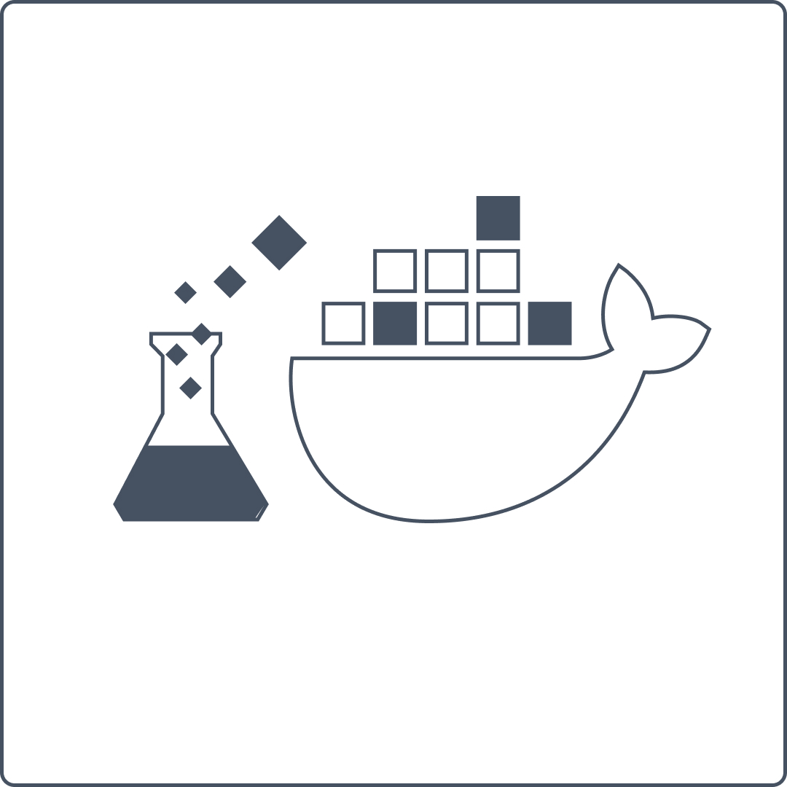

# MLDock
A docker tool that helps put machine learning in places that empower ml developers

<p align="center">
 
</p>

A docker tool that helps put machine learning in places that empower ml developers, it builds in convenience and power of docker and frames it around the core machine learning tasks. Namely building ml container images, developing training scripts and deployment scripts and most importantly deploying your model container to the cloud platform of your choice. Inspired by [Sagify](https://github.com/Kenza-AI/sagify), [Sagemaker Training Toolkit](https://github.com/aws/sagemaker-training-toolkit) and [Amazon Sagemaker](https://aws.amazon.com/sagemaker/) the goal of mldock are supporting standardisation and reducing the headache of getting docker to work for machine learning.

MLDock is
- Low barrier to entry ✅
- Make the only the changes you need ✅
- Any ML framework ✅
- Work for any docker based workflow ✅

This is achieved through:
- simple cli tool to configure a new project
- templates and wireframes to seed your project
- code helpers to extend and support your workflow
- Built with docker, for docker and with docker in mind

What it is not:
- Service orchestrator ❌
- Training Scheduler ❌
- Hyperparameter tuner ❌
- Experiment Tracking ❌


"""

- tests
	- test platform helpers in container
# in development of helpers, COPY setup.py and install
COPY ./mldock /opt/program/mldock
COPY ./README.md /opt/program/README.md
COPY ./setup.py /opt/program/setup.py
COPY ./setup.cfg /opt/program/setup.cfg
RUN pip install -e .
	- test cli
		- test container init
			- no-prompt == True
			- no-prompt == False
			- init --remote=<GIT-URL> --template_dir
			- init --template_dir
- resolve
	- error: HTTPConnectionPool(host='localhost', port=2375): Read timed out. Potentially just catching this situation and re-attaching.
	- error: ERROR [internal] load build definition from Dockerfile. This may be a docker related issue
- new features and migration
	- migrate login and push to python docker api and support both AWS ECR and Google CR, potentially Azure in future.
	- add github pages documentation
	- add CloudRun support supported container init
	- add ECS support supported container init
	- add Kubernetes supported container init
	- add service/kubernetes/stateless.yml
	

"""


README
- names: MLArtisan, MLDock(taken by npm guy in JS, though very low use and I am the only pypi package)
- MLDOCK ```A docker tool for ML that helps put ML in the places that empower Data Scientists```
- Why another tool?
	```
		There are many great tools for productionizing ML. In fact, this work takes a lot of inspiration from tools such as Sagify, MLFlow (Containers) and Sagemaker_training. Our main goal is to minimize headache while supporting platform independence.
		
		MLDOCK aims to offer:

		1. Docker-based tool which removes the headaches from containerizing ML with docker.
		2. Development tools that empower data scientists to develop, train and deploy more easily. (quick start, no fuss)
		3. Closing the gap between MLOps and Data Science. (MLOPS can easily and quickly put optimizations and updates in the hands of DS.)
		4. An opiniated development experience that plays well with others (Sagemaker, GAIPlatform, Kubernetes, AzureMLPlatform, Fargate, CloudRun, AzureContainerInstances, Docker-compose)

		What MLDOCK is not:

		1. An orchestration/maintenance tool (Tools like Sagemaker, Kubernetes, Airflow)
		2. Asset tracking tool (Tools like dvc, mlflow and wandb)

		Contributing:

		1. [Fork it!, CHECKOUT! -b my-new-feature, PR across forks](https://docs.github.com/en/github/collaborating-with-issues-and-pull-requests/creating-a-pull-request-from-a-fork)

	```
- documentation on API
- MLDOCK supports environment variables in both training and deploy. For uses with 3rd party platforms, make sure environment variables can be passed to the container.

- future:
	- example container based on mms: https://github.com/awslabs/multi-model-server


# SERVICE USE-CASES

## Windows

DOCKER_HOST=tcp://127.0.0.1:2375

## GCP AI Platform
- one disclaimer: AI Platform does not support setting environment variables. Over-come this by setting ENV variables within the dockerfile
Pushing to GCR
- gcloud auth login
- gcloud config set project <ProjectID>

Authenticate with gcloud for client libraries
- gcloud auth application-default login

Train model
- update dockerfile by setting paths to your data as environment variables

- execute a training job
gcloud ai-platform jobs submit training custom_container_job_$(date +%Y%m%d_%H%M%S) --master-image-uri=eu.gcr.io/angular-vortex-304218/container_test_generic_py38_cpu --region=europe-west3 --staging-bucket=gs://sandbox-model-experiments --job-dir=gs://sandbox-model-experiments/custom_container_job_$(date +%Y%m%d_%H%M%S) -- train --factors=10


## Kubernetes

- first create your kubernetes cluster as required.
#### On WIndows (WSL) KinD + Kubectl
# (comment) Check if the KUBECONFIG is not set
echo $KUBECONFIG
# (comment) Check if the .kube directory is created > if not, no need to create it
ls $HOME/.kube
# (comment) Create the cluster and give it a name (optional)
kind create cluster --name wslkind
# (comment) Check if the .kube has been created and populated with files
ls $HOME/.kube
# (comment) Check cluster is available
kubectl cluster-info

# Create kubernetes resources
kubectl apply -f sandbox/kubernetes/example-deployment.yaml

# port-forwarding to access service (SVC) from outside the cluster without DNS
kubectl port-forward svc/mldock-service 8080:8080 -n default

# delete all kubernetes resources
kubectl delete -f sandbox/kubernetes/example-deployment.yaml

# finally, delete cluster
kind delete cluster --name wslkind
```